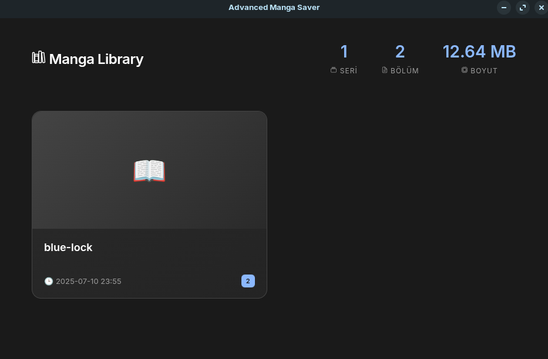
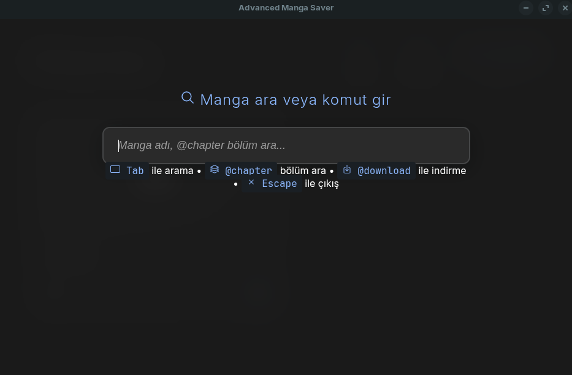
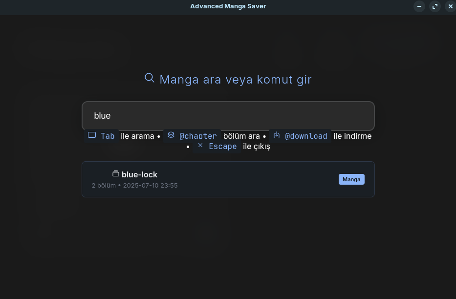
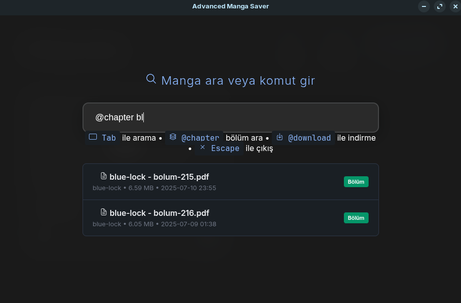
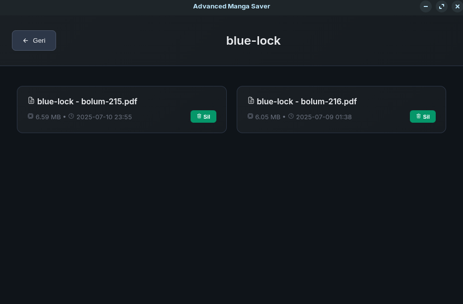
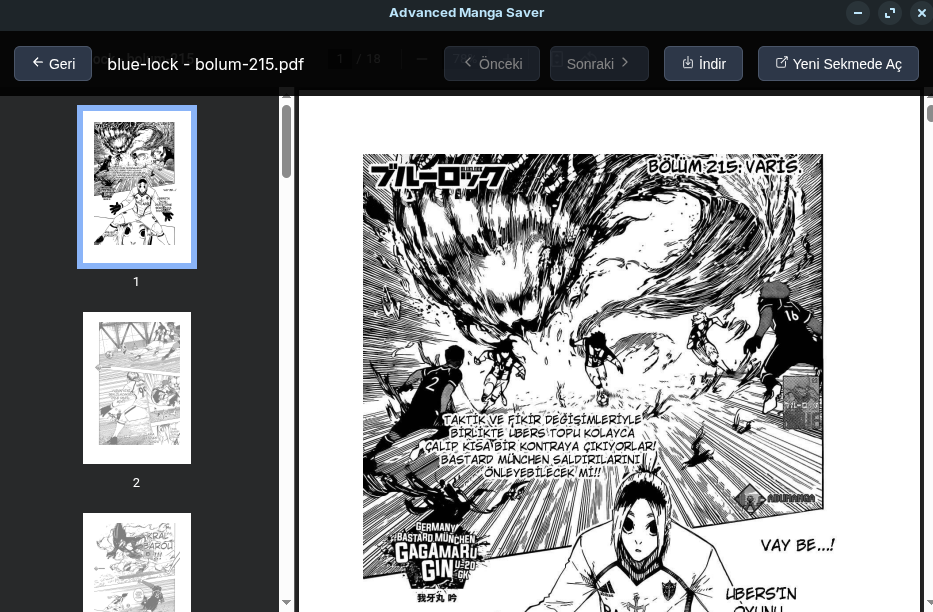

# Advanced Manga Saver

**Reason for development:**
I read my manga on trmangaoku.com. However, you can make a few changes to the code to make this tool work on other sites as well. The main reason why I started this project is to collect resources that will help me alleviate some of my boredom when I am without internet. This is a habit I have from my childhood. With this tool, you too can store your manga like I did and save them to read again later.

### New additions
In the previous version of the code I was using selenium, but I updated the code and used **crawl4ai** instead. This way I added more features and you can integrate it to your own manga sites by making small changes.
I didn't do it because I researched the most popular manga sites and couldn't find sites that publish the manga I read, so I wrote it specifically for this site.

**Important notes:**
I wrote this system for myself, you can also use it for yourself but use it considering legal warnings.

**Technical Details:**
- Backend development (FastAPI, Crawl4ai integration, PDF generation): Self-coded
- Frontend interface (web UI, responsive design, JavaScript): Developed with AI assistance

The reason I did it this way was to be able to use it as a desktop application. I can use the web interface as a desktop application using the eel library. I am someone who likes to carry the applications I develop on my flash drive. With this application, I can organize my manga on my flash drive with an interface. You can convert it to exe using nuitka or pyinstaller.

### Usage
- Pressing **Tab** opens the searchbar (only works on the main screen)
- You can download using **@download** trmanga link. If the manga is downloaded for the first time, it creates a folder, if there is a previously downloaded one, it saves under the existing folder
- If you don't use **@**, you can search for manga name
- **@chapter** you can search manga chapters

#### Nuitka build command
```bash
python3 -m nuitka --standalone --onefile --include-data-dir=web=web --output-filename=MangaSaver app.py
```

#### Example Curl command
```bash
curl -X POST "http://localhost:8000/" -H "Content-Type: application/json" -d '{"link": "https://trmangaoku.com/manga/blue-lock/bolum-215/"}'
```

**Preview:**
| Main Screen | Search | Search Manga |
|-------------|--------|--------------|
|  |  |  |
| **Search Chapter** | **Chapter View** | **Reading** |
|  |  |  |

## Installation
**Crawl4ai must be installed** <a href="https://github.com/unclecode/crawl4ai" alt="_blank">Click for install</a>

```bash
pip3 install -r requirements.txt
```

First run the main.py file, open a new terminal and this time run app.py or you can run the curl code I gave above.